# Functional Design

# Introduction

## Problem

## Problem analysis

## Context research

# Solution overview

## Solution vision
### The Problem
The client needed a real-time collaboration tool to brainstorm ideas and display them visually in real time. 
The lack of real-time interaction, advanced features like action replays, and role-based access control makes it difficult for teams to collaborate efficiently and stay organized.
Our task is to provide the client with a reliable editing tool that combines visual diagramming. This tool will offer features like real-time collaboration, 
session management, Git integration, and role-based permissions, ensuring an efficient and user-friendly solution for team brainstorming ideas.

### The Envisioned Solution
Our proposed solution is an innovative collaborative editing tool that combines the flexibility of visual diagramming (like draw.io). 
This tool is designed to streamline the brainstorming for teams by providing real-time collaboration features with enhanced functionality 
and seamless integration.

#### The features our solution proposes

1. Authentication and User Management:
    * User access with login credentials and the ability for administrators to manage new and/or existing users.
2. Role-Based Access Control:
   * Role distinctions (Administrator, Leader, Developer) ensure that permissions align with user responsibilities, such as managing sessions, inviting collaborators, managing users.
3. Session Management:
   * Leaders can create, close, and reopen sessions to organize their work.
   * A dashboard lists all active sessions accessible to the user.
4. Invitation System:
   * Leader can invite specific team members to sessions, ensuring that only relevant users participate in discussions and editing.
5. Real-Time Collaboration:
   - Users can work together on a shared visual editor, seeing each other's actions (e.g., mouse cursor, edits) in real time.
   - Supports a rich visual interface with objects, arrows, labels, and customization options (e.g., color, styles).
6. Git Integration:
   * Leader can export session outcomes directly to a Git repository, saving work as Markdown file for further usage.
7. Replay Functionality:
   * There is a feature to view the history of changes, leaders can undo the last action
8. Statistical Insights:
   * A dedicated statistics page shows contributions from team members, visualized through metrics like action counts.

## Scope

## Requirements

Feature 1: Editor

| ID     | Description                                                                                         | Priority | Source                               | 
|--------|-----------------------------------------------------------------------------------------------------|----------|--------------------------------------|
| U1.1   | As a developer I want to cooperate with other users in real time.                                   | MUST     | Interview 1 & Assignment description |
| S1.1.1 | The system shows the mouse cursor of a user with their name that is currently in the editor.        | MUST     | U1.1                                 |
| S1.1.2 | The system should utilize WebSockets/SocketIO to provide real time cooperation functionality.       | SHOULD   | U1.1                                 |
| U1.2   | As a developer I want to work with the visual editor of objects.                                    | MUST     | Interview 1                          |
| S1.2.1 | The system should provide rectangles, arrows, labels related to other objects.                      | MUST     | U1.2                                 |
| S1.2.2 | The system should provide the ability to add, move, and delete objects.                             | MUST     | U1.2                                 |
| S1.2.3 | The system should provide the ability to connect objects with arrows.                               | MUST     | U1.2                                 |
| S1.2.4 | The system should provide the ability to add labels to objects.                                     | MUST     | U1.2                                 |
| S1.2.5 | The system should provide the ability to change the color of objects.                               | MUST     | U1.2                                 |
| S1.2.6 | The system should provide the ability to change styles of arrows.                                   | MUST     | U1.2                                 |
| S1.2.7 | The system should automatically resize rectangles based on the amount of text content in the label. | SHOULD   | U1.2                                 |
| S1.2.8 | The system should provide the ability to zoom in and out.                                           | COULD    | U1.2                                 |
| S1.2.9 | The system should provide the ability to add images to the canvas.                                  | COULD    | U1.2                                 |

Feature 2: Git Integration

| ID     | Description                                                                                                            | Priority | Source                               |
|--------|------------------------------------------------------------------------------------------------------------------------|----------|--------------------------------------|
| U2.1   | As a leader I want to save the current state of the project to the Git repository.                                     | MUST     | Interview 1 & Assignment description |
| S2.1.1 | The system should provide the ability for the lead to export the result of the session to the provided Git repository. | MUST     | U2.1                                 |
| S2.1.2 | The system exports the result of the session as the Markdown file or any other viewable/renderable type of a file.     | MUST     | Interview 1                          |

Feature 3: Sessions

| ID     | Description                                                                                            | Priority | Source                               |
|--------|--------------------------------------------------------------------------------------------------------|----------|--------------------------------------|
| U3.1   | As a leader I want to create a new session so that I can start a new document.                         | MUST     | Interview 1 & Assignment description |
| S3.1.1 | The system has a button for starting a new session.                                                    | MUST     | U3.1                                 |
| U3.2   | As a leader I want to be able to close active sessions or to set status to active for the closed ones. | MUST     | Interview 1                          |
| S3.2.1 | The system should provide a button to close an active the session.                                     | MUST     | U3.2                                 |
| S3.2.2 | The system should provide a button to make closed session opened.                                      | MUST     | U3.2                                 |
| U3.3   | As a developer I want to be able to access the editor for an active session.                           | MUST     | Interview 1                          |
| S3.3.1 | The system has a dashboard page with a list of active sessions that the user has access to.            | MUST     | U3.3                                 |

Feature 4: Invitations

| ID     | Description                                                                                        | Priority | Source                               |
|--------|----------------------------------------------------------------------------------------------------|----------|--------------------------------------|
| U4.1   | As a leader I want to invite other users to the session so that they can join the collaboration.   | MUST     | Interview 1 & Assignment description |
| S4.1.1 | The system should provide a button on the session's editor page that leads to the invitation page. | MUST     | U4.1                                 |
| S4.1.2 | The invitation page should list all of the users and provide a button to invite them.              | MUST     | U4.1                                 |
| S4.1.3 | The invitation page should provide a functionality to search for the users.                        | SHOULD   | U4.1                                 |
| S4.1.4 | The users that was invited can access the session on their session list.                           | MUST     | U4.1                                 |

Feature 5: Replays

| ID     | Description                                                                    | Priority | Source                               |
|--------|--------------------------------------------------------------------------------|----------|--------------------------------------|
| U5.1   | As a leader I want to replay the session to analyse the whole thought process. | MUST     | Interview 1 & Assignment description |
| S5.1.1 | The system should have a list of actions done to the document.                 | MUST     | U5.1                                 |
| U5.2   | As a leader I want to control past actions done to the document.               | SHOULD   | Interview 1                          |
| S5.2.1 | The system should have a button to undo the **last** action.                   | SHOULD   | U5.2                                 |
| S5.2.2 | The system should have a button to undo the action.                            | COULD    | U5.2                                 |
| S5.2.3 | The system should have a button to redo the action.                            | COULD    | U5.2                                 |

Feature 6: Statistics

| ID     | Description                                                                                                                     | Priority | Source                               |
|--------|---------------------------------------------------------------------------------------------------------------------------------|----------|--------------------------------------|
| U6.1   | As a team member I want to see the statistics of the collaboration process to know how effective the brainstorm process is.     | MUST     | Interview 1 & Assignment description |
| S6.1.1 | The system should have a button on the session's editor page that leads to the statistics page.                                 | MUST     | U6.1                                 |
| S6.1.2 | The statistics page should provide the information about the number of actions done to the document in relation to each member. | MUST     | U6.1                                 |
| S6.1.3 | The statistics page should provide heatmaps showing the contributions of each user relative to sessions they have access to.    | COULD    | Assignment description               |

Feature 7: Role based access

| ID     | Description                                                                                                                              | Priority | Source                               |
|--------|------------------------------------------------------------------------------------------------------------------------------------------|----------|--------------------------------------|
| U7.1   | As a team member I want to have different roles such as administrator, lead and user so that I can have different permissions.           | MUST     | Interview 1 & Assignment description |
| S7.1.1 | The system provides 3 roles: administrator, leader and developer. See the rights for each role here: [Rights for each role](#user-roles) | MUST     | U7.1                                 |
| U7.2   | As an administrator I want to be able to manage leaders.                                                                                 | MUST     | Interview 1 & Assignment description |
| S7.2.1 | The system has a button to promote a team member to a leader or demote a leader.                                                         | MUST     | U7.2                                 |

Feature 8: Authentication

| ID     | Description                                                                                                     | Priority | Source |
|--------|-----------------------------------------------------------------------------------------------------------------|----------|--------|
| U8.1   | As a user I want to log in to the system using my email address and a password I set.                           | MUST     | Advice |
| S8.1.1 | The system shows a log in form with email address and address inputs to guests.                                 | MUST     | U8.1   |
| S8.1.2 | The system authenticates the user by matching a user account in the database based on the provided credentials. | MUST     | U8.1   |
| S8.1.3 | The system generates a valid JWT token for an authenticated user.                                               | MUST     | U8.1   |
| U8.2   | As a user I want to change my password at any time.                                                             | MUST     | Advice |
| S8.2.1 | The system has a separate page with settings for the user to change their own password.                         | MUST     | U8.2   |

Feature 9: User management

| ID     | Description                                                                                                    | Priority | Source               |
|--------|----------------------------------------------------------------------------------------------------------------|----------|----------------------|
| U9.1   | As an administrator I want to be able to create accounts for other users.                                      | MUST     | Interview 1 & Advice |
| S9.1.1 | The system has a page with a form with an email address, a password, and a role selection for creating a user. | MUST     | U9.1                 |
| U9.2   | As an administrator I want to edit/delete existing user accounts.                                              | SHOULD   | Interview 1 & Advice |
| S9.2.1 | The system has a button leading to a list of users that can be managed.                                        | SHOULD   | U9.2                 |
| S9.2.2 | The system has a button to delete an existing user account (which is not an administrator).                    | SHOULD   | U9.2                 |
| S9.2.3 | The system has a form for editing the email address of an existing user account.                               | COULD    | U9.2                 |

## Risks and assumptions

# Functional specs

## Business logic: roles, rules and data involved

### User Roles

- **Administrator**
    - Only one user has this role. The user account is preconfigured with a fixed email address and password.
    - They appoint (and demote) leaders.
    - They should have access to all sessions.
    - They can create new user accounts.
- **Leader**
    - Replay functionality is accessible only to leaders.
    - They start new sessions and can manage them.
    - They invite other users to sessions.
    - They make sure that developers stick to the subject of the session.
    - They can save the progress of a document to a Git repository.
- **Developer**
    - They participate in brainstorming sessions.

## User Stories

1. As a developer, I want to participate in online sessions with other team members, so I can evaluate ideas with the
   entire team or come up with designs for software.
2. As a developer, I want to work with objects, arrows, and labels in a visual editor, so I can present my ideas.
3. As a team member, I want to see contributions of other developers during sessions, so I know how effective the
   brainstorming process is.
4. As a leader, I want to see the action history done during a session, so I can analyze the entire thought process.
5. As a leader, I want to export the result of the session into a Git repository, so I can store the result
   independently to the system.
6. As a leader, I want to start a new session, so others can participate.
7. As a leader, I want to close an active session, so nobody can contribute to resolved topics anymore.
8. As a leader, I want to invite other members to a sessions, so they can participate in the brainstorming process.
9. As an administrator, I want to appoint new leaders, so they can manage sessions.
10. As an administrator, I want to add new team members to the system, so they can utilize the online editor.
11. As an administrator, I want to manage accounts of other users, so I have full control over who has access to the
    system.
12. As a team member, I want to be able to change my password, so I can properly secure my account.
13. As a leader, I want to be able to undo actions done to the system, so I can revert changes.

## Mockups and wireframes (Low-Fidelity)

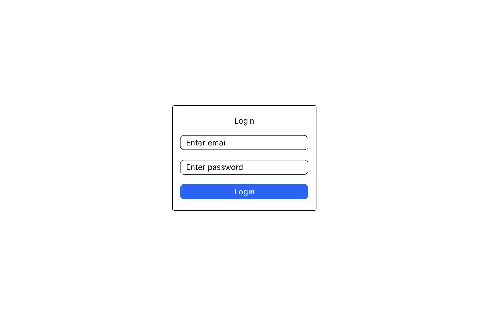

Login page allows users that are part of the system to login to the system by providing email and password.

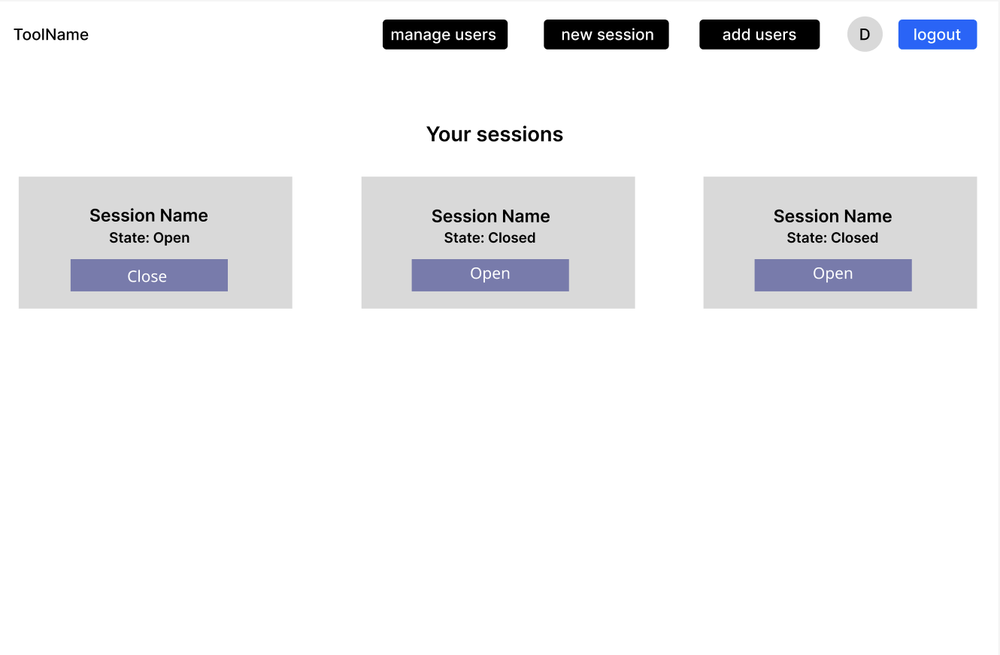

Once logged in, user will be able to join possible sessions that he/she has been added to or depending on the role, user’s own created sessions. Session has two buttons to keep track of current session status: open (to open) and close (to close) - leads can manage it. 
On top, there are 5 buttons : manage users (only for admin), create a new session (only for leaders), add new users (only for administrator), circled first letter username (leads to change user's current password) and logout button to leave an account.

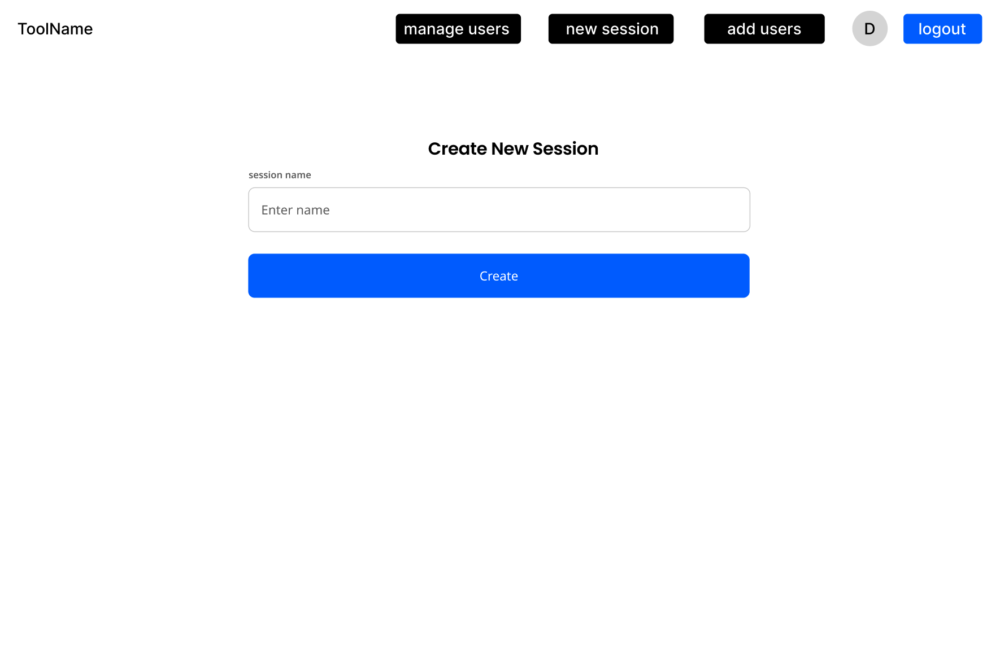

Leader or administrator can create a new session by providing a name.

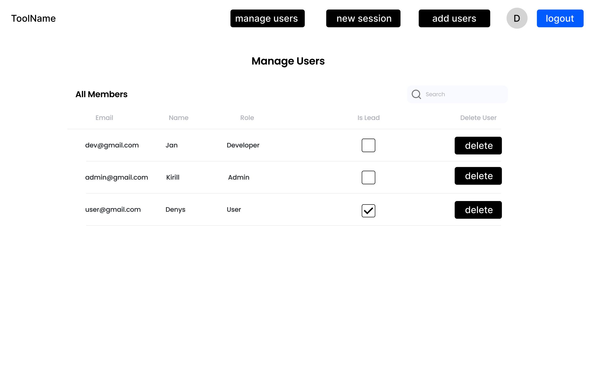

Admin can manage users by assigning and unassigning leader. "Delete" button to delete an existing user.

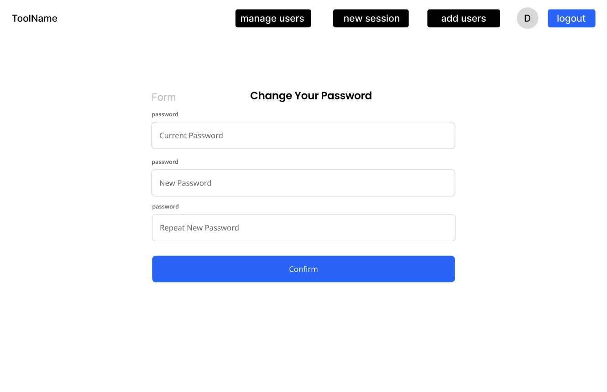

After successfully logging in, the user can change their current password. This page is accessible by clicking on the first letter of their name (displayed in a circle) next to the logout button.

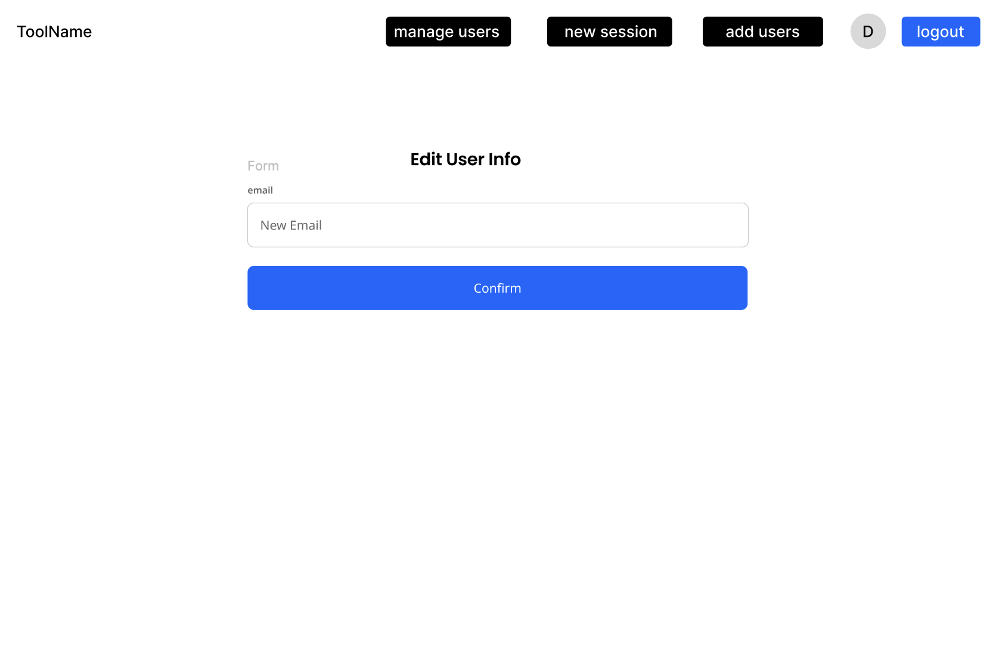

Admin can edit user's email by clicking on user in 'Manage Users' page. Additionally, admin can search for the user by an email. 

On the left-hand side, the "Export" button is used to export the created diagram as a Markdown file to Gitlub. The project leader can invite new members to the project by clicking the "Invite Members" button. 
Below these options, movable objects and arrows are available for creating and editing diagrams. The "Explore Statistics" button displays the number of contributions made by project members. 
The "View History" button provides a list of all changes made by project members. 

On the right-hand side, a collaboration space is provided. Users can create different diagrams and view changes in real time. Objects can easily be deleted by clicking on it and press "delete" keyboard. If user wants to change a label, he/she just presses a label and can immediately change it. Moreover, when someone is making a change, their cursor, along with their name, will be visible.

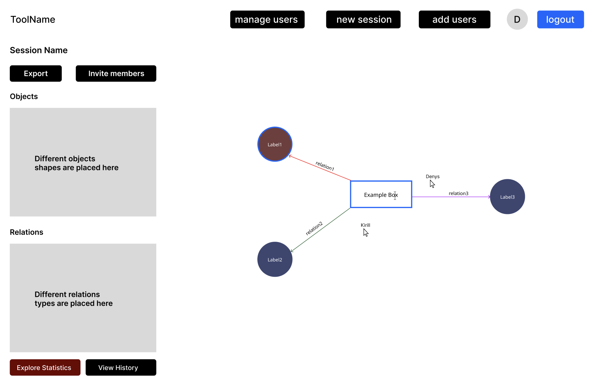

If the users decide to change the object or label, they can simply select the object, and a blue radius will appear. For changing the label, an editing cursor will be displayed.

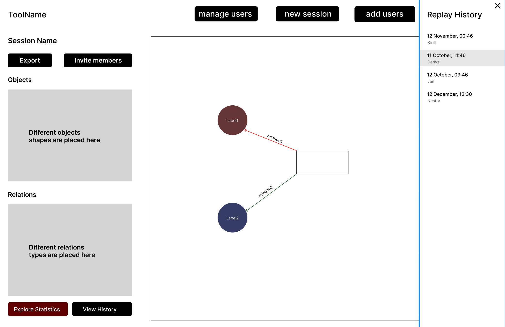

When clicking on a replay entry in the history, the saved state as a diagram will be visible. 

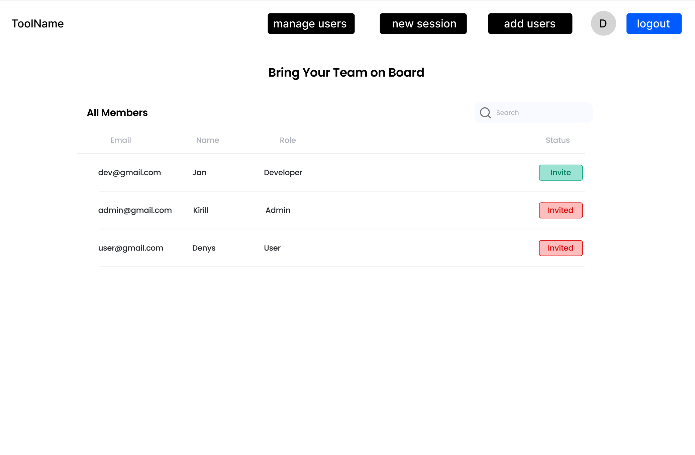

Project admin can invite users to existing project. Additionally, he/she can search for the user by email. 

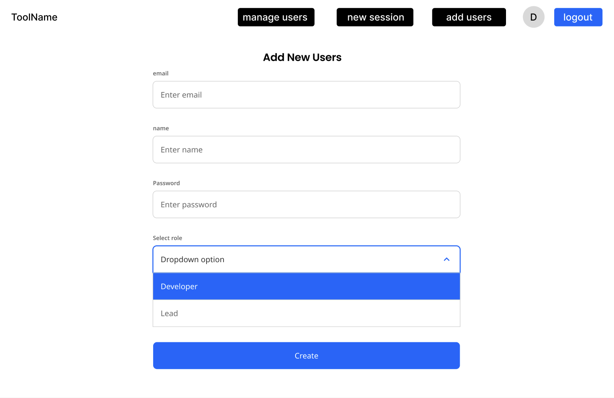

Administrator can create a new user by providing an email, name, password and role. 

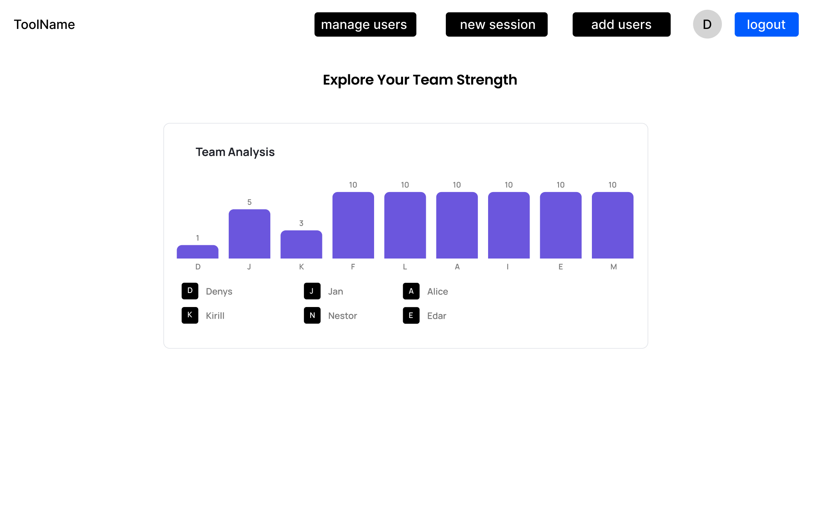

Users can see the names of contributors along with the number of changes they have made, allowing for easy identification of the most active participants in the project.

# System architecture

## Basic architecture with logical components

## Deploy and Component diagram

# Change Log
