# Functional Design

## Introduction

This document provides a functional design for the collaborative editing tool. The tool is designed to streamline the
brainstorming process for teams by providing real-time collaboration features with enhanced functionality, such as
session management, Git integration, and role-based permissions, ensuring an efficient and user-friendly solution.

### Problem Analysis

From the assignment description and after the first interview, it became apparent that the client is looking for a
real-time collaboration tool. However, there is a slight deviation from the assignment description; the client wants to
brainstorm ideas by creating diagrams, not a Markdown editor. Furthermore, according to the client, analyzing this
process is very important to keep everyone equally involved and to iterate further and improve it. This can be done
either via "replays" (viewing past actions of members), charts, and/or heatmaps.

The tool must restrict unauthorized users from accessing the system and brainstorming sessions. Moreover, each user is
assigned a role that determines their level of access. In short, **developers** participate in sessions, **leaders**
manage and analyze sessions, and the **administrator** manages all users and appoints leaders.

The client wishes to export a session's result, which can then be used in a Markdown file or easily viewed in any other
way. The result should be stored in a GitLab repository based on the assignment description.

### Alternatives

draw.io is the first alternative for creating diagrams. Despite not being known for this, it also offers
[real-time collaboration][1], [version history][2], and access control (with roles) in case the file is stored in an
external cloud service supporting this (e.g., Google Drive). The result can be exported as a file (SVG, PNG, ...) or
directly to an [external service, including GitLab][3].

There are many other platforms that fit clients' needs, such as [Lucidchart][4] or [Miro][5]; however, these solutions
are commercial and can often be very expensive. Furthermore, they are not tailored to the customer's needs.

## Business Requirements

| ID  | Description                                                                                                                        | MoSCoW | Source     |
|-----|------------------------------------------------------------------------------------------------------------------------------------|--------|------------|
| B1  | The system allows developers to collaborate in real time.                                                                          | M      | Assignment |
| B2  | The system provides a visual editor to create mind maps.                                                                           | M      | Interview  |
| B3  | The system must prevent users who are not a part of the team accessing brainstorming sessions.                                     | M      | Interview  |
| B4  | The client wants team leaders to have the ability to export the result of a brainstorming session to the team's GitLab repository. | M      | Assignment |
| B5  | The client wants team leaders to have the ability to view a replay of all manipulations in a session.                              | M      | Assignment |
| B6  | The system provides members of a session to view relevant statistics on the collaboration process.                                 | M      | Assignment |
| B7  | The client wants team leaders to manage who can access a brainstorming session.                                                    | M      | Interview  |
| B8  | The client wants one administrator to appoint leaders.                                                                             | M      | Assignment |
| B9  | The client does not want guest users to modify documents.                                                                          | M      | Interview  |
| B10 | The client does not want to have a junk of users in the database.                                                                  | S      | Interview  |
| B11 | The client wants team leaders to have the ability to rollback to a past version of a session.                                      | C      | Interview  |
| B12 | The client wants guest users to have the ability to comment on a session.                                                          | W      | Interview  |

## Solution Overview

1. Authentication and User Management:
    * User access with login credentials and the ability for administrators to manage new and/or existing users.
2. Role-Based Access Control:
    * Role distinctions (Administrator, Leader, Developer) ensure that permissions align with user responsibilities,
      such as managing sessions, inviting collaborators, managing users.
3. Session Management:
    * Leaders can create, close, and reopen sessions to organize their work.
    * A dashboard lists all active sessions accessible to the user.
4. Invitation System:
    * Leader can invite specific team members to sessions, ensuring that only relevant users participate in discussions
      and editing.
5. Real-Time Collaboration:
    - Users can work together on a shared visual editor, seeing each other's actions (e.g., mouse cursor, edits) in real
      time.
    - Supports a rich visual interface with objects, arrows, labels, and customization options (e.g., color, styles).
6. Git Integration:
    * Leader can export session outcomes directly to a Git repository, saving work as Markdown file for further usage.
7. Replay Functionality:
    * There is a feature to view the history of changes, leaders can undo the last action
8. Statistical Insights:
    * A dedicated statistics page shows contributions from team members, visualized through metrics like action counts.

## Requirements

### Functional Requirements

| ID  | Description                                                                                                                | MoSCoW | Source     |
|-----|----------------------------------------------------------------------------------------------------------------------------|--------|------------|
| F1  | A developer can access a session they were invited to.                                                                     | M      | Assignment |
| F2  | Display a list of sessions that the user has access to.                                                                    | M      | Advice     |
| F3  | The system must prevent unauthorized users from accessing a session or its content.                                        | M      | Interview  |
| F4  | A session member can see the activity of other members of the session in real time.                                        | M      | Assignment |
| F5  | A session member can place new nodes in the visual editor.                                                                 | M      | Interview  |
| F6  | A session member can connect existing nodes in the visual editor together.                                                 | M      | Interview  |
| F7  | A session member can put custom labels on nodes or connection between nodes in the visual editor.                          | M      | Interview  |
| F8  | A session member can include images in the visual editor.                                                                  | C      | Interview  |
| F9  | A leader can export the current state of the document to a GitLab repository in a user-friendly format.                    | M      | Assignment |
| F10 | A leader can start a new session with a custom name.                                                                       | M      | Assignment |
| F11 | A leader can close an ongoing session that they are a part of.                                                             | M      | Interview  |
| F12 | The system does not allow changes to a closed session.                                                                     | S      | Advice     |
| F13 | A leader can invite other users to a session.                                                                              | M      | Assignment |
| F14 | A leader can remove members from a session that they are a part of.                                                        | M      | Interview  |
| F15 | A leader can see a list of team members with a status in regards to the session (invited/not invited).                     | S      | Advice     |
| F16 | A leader can view a list of history actions done in a document with the username of the author and the type of the action. | M      | Interview  |
| F17 | A leader can view a past state of the document.                                                                            | M      | Interview  |
| F18 | A leader can apply a past state of a document.                                                                             | C      | Interview  |
| F19 | A leader can undo actions done to a document by other session members.                                                     | C      | Interview  |
| F20 | A team member can view statistics of an activity (a summary of action weights) in a session they are a part of.            | M      | Interview  |
| F21 | An administrator can appoint a leader.                                                                                     | M      | Interview  |
| F22 | An administrator can change a leader back to a user.                                                                       | M      | Interview  |
| F23 | An administrator creates new user accounts.                                                                                | M      | Advice     |
| F24 | An administrator can modify the account of other users.                                                                    | C      | Advice     |
| F25 | An administrator can delete other users.                                                                                   | C      | Advice     |
| F26 | A user can log in to the system using their unique email address and password.                                             | M      | Advice     |
| F27 | A user can change their password.                                                                                          | M      | Interview  |
| F28 | Display the current user's role in a clear way on every page.                                                              | S      | Interview  |
| F29 | A node in the visual editor with more connections should be clearly highlighted from other nodes.                          | C      | Interview  |
| F30 | A node in the visual editor with no connections should stand out.                                                          | C      | Interview  |
| F31 | A node in the visual editor can have multiple (2+) connections.                                                            | C      | Interview  |
| F32 | A guest user can comment on a session.                                                                                     | W      | Interview  |

### Non-Functional Requirements

| ID   | Description                                                                                         | MoSCoW | Source     |
|------|-----------------------------------------------------------------------------------------------------|--------|------------|
| NF1  | The backend is built using Node.js with Express.js.                                                 | M      | -          |
| NF2  | The frontend is built using Svelte (not Svelte Kit).                                                | M      | -          |
| NF3  | The application should be accessible from a desktop and tablet devices.                             | M      | Email      |
| NF4  | The system stores an anonymized user account after deletion to retain a clear history of actions.   | C      | F25        |
| NF5  | The system uses [three roles for authorization](#user-roles): Developer, Leader, and Administrator. | M      | Assignment |
| NF6  | A user can be both an administrator and a leader.                                                   | S      | -          |
| NF7  | There is only one administrator account in the system that is created upfront.                      | M      | -          |
| NF8  | The system generates a valid JWT token for an authenticated user.                                   | M      | -          |
| NF9  | Passwords must be stored as a hash that is a result of the bcrypt function.                         | M      | -          |
| NF10 | The contrast between a background color and text must meet the WCAG AA standard (4.5:1 ratio).      | C      | Interview  |
| NF11 | The system should not use dull colors as the primary color scheme.                                  | C      | Interview  |
| NF12 | A session supports up to 10 members in real time.                                                   | S      | Interview  |

## User Roles

- **Administrator**
    - Only one user has this role. The user account is preconfigured with a fixed email address and password.
    - They appoint (and demote) leaders.
    - They should have access to all sessions.
    - They can create new user accounts.
- **Leader**
    - Replay functionality is accessible only to leaders.
    - They start new sessions and can manage them.
    - They invite other users to sessions.
    - They remove participants from sessions.
    - They make sure that developers stick to the subject of the session.
    - They can save the progress of a document to a GitLab repository.
- **Developer**
    - They participate in brainstorming sessions.

## User Stories

1. As a developer, I want to participate in online sessions with other team members, so I can evaluate ideas with the
   entire team or come up with designs for software.
2. As a developer, I want to see the cursor of other participants in a session, so I know what they are editing.
3. As a developer, I want to work with nodes, arrows, and labels in a visual editor, so I can present my ideas.
4. As a team member, I want to see contributions of other developers during sessions, so I know how effective the
   brainstorming process is.
5. As a leader, I want to see the action history done during a session, so I can analyze the entire thought process.
6. As a leader, I want to export the result of the session into a GitLab repository, so I can store the result
   independently to the system.
7. As a leader, I want to start a new session, so others can participate.
8. As a leader, I want to close an active session, so nobody can contribute to resolved topics anymore.
9. As a leader, I want to invite other members to a sessions, so they can participate in the brainstorming process.
10. As an administrator, I want to appoint new leaders, so they can manage sessions.
11. As an administrator, I want to add new team members to the system, so they can join brainstorming sessions.
12. As an administrator, I want to manage all user accounts, so I have full control over who has access to the system.
13. As a team member, I want to be able to change my password, so I can properly secure my account.
14. As a leader, I want to be able to undo actions done to the system, so I can revert irrelevant changes.
15. As a guest user, I want to comment on an active session that can be seen by its members, so I can provide feedback.

## Mockups and wireframes (Low-Fidelity)

### 1. Authentication

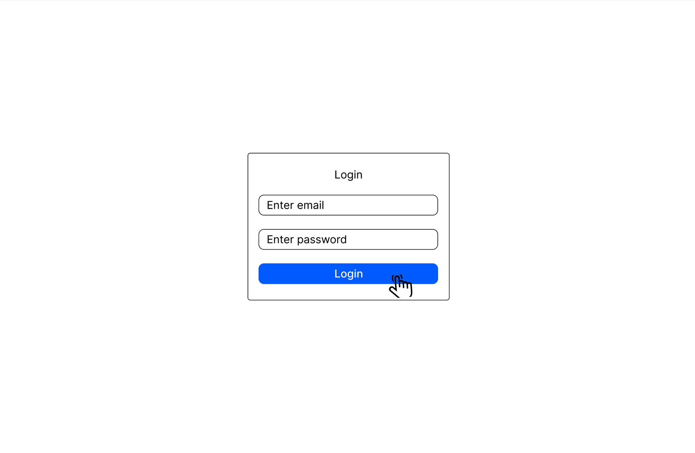

Login page allows users that are part of the system to login to the system by providing email and password.

### 2. Dashboard and navigation

#### Home page

Once logged in, user will be able to join possible sessions that he/she has been added to or depending on the role,
user’s own created sessions. Session has two buttons to keep track of current session status: open (to open) and close
(to close) - leads can manage it. On top, there are 5 buttons : manage users (only for admin), create a new session
(only for leaders), add new users (only for administrator), circled first letter username (leads to change user's
current password) and logout button to leave an account.

### 3. Session management

#### Create a new session

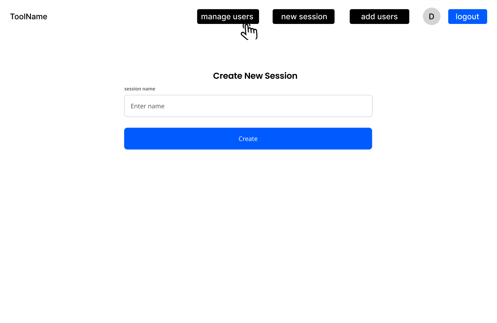

Leader or administrator can create a new session by providing a name.

#### Manage users

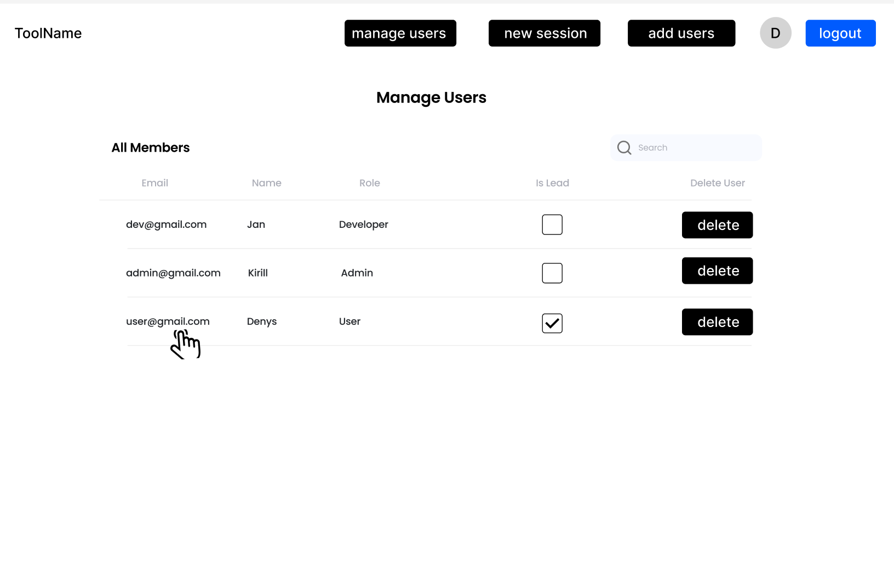

Admin can manage users by assigning and unassigning leader. "Delete" button to delete an existing user.

#### Edit user

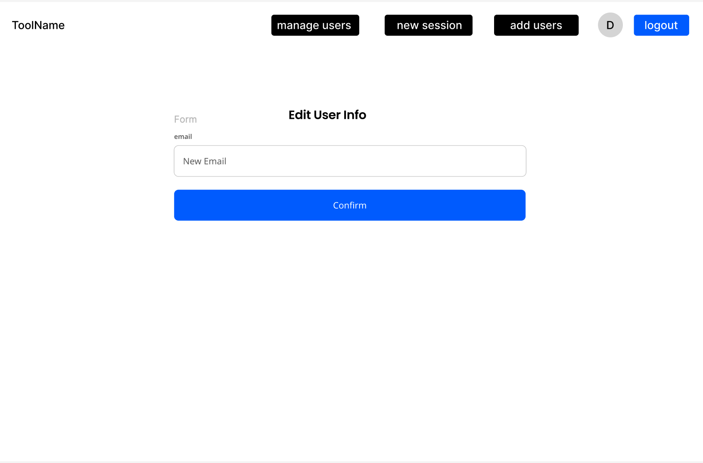

Admin can edit user's email by clicking on user in 'Manage Users' page. Additionally, admin can search for the user by
an email.

### 4. User settings

The user can change their current password at any time by accessing their profile. This can be done from any page by
clicking on the first letter of their name, displayed in a circle, located in the header next to the logout button.

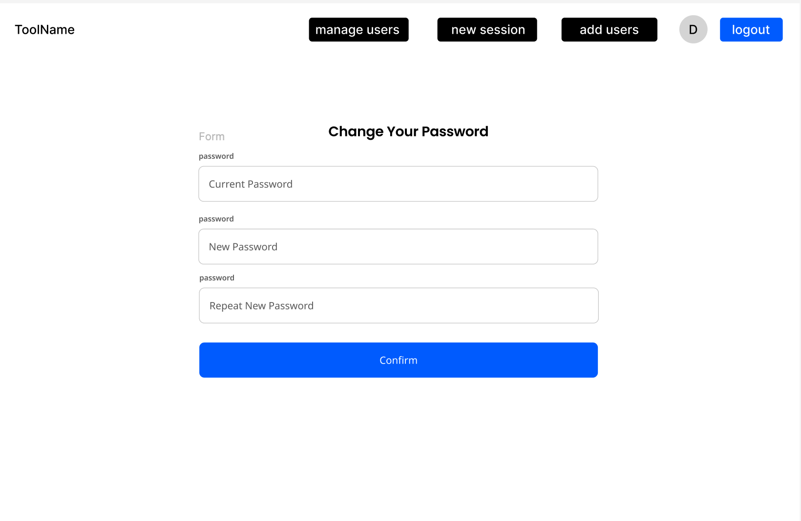

### 5. Collaboration and diagram editor

#### Accessing the editor

By clicking on session card, user can access the editor.

#### History and replay

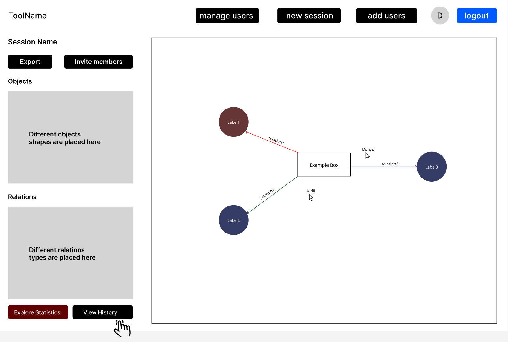

The "View History" button provides a list of all changes made by project members.

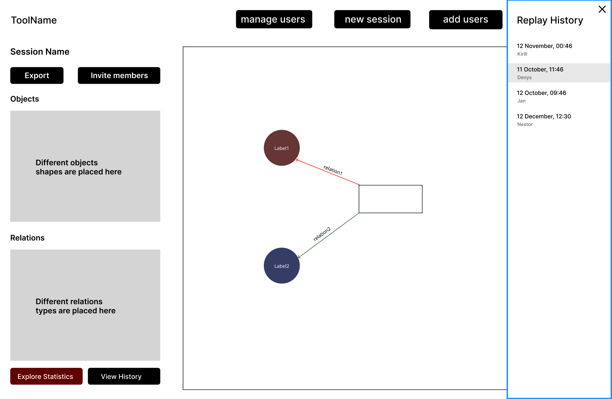

When clicking on a replay entry in the history, the saved state as a diagram will be visible.

#### Real-time collaboration

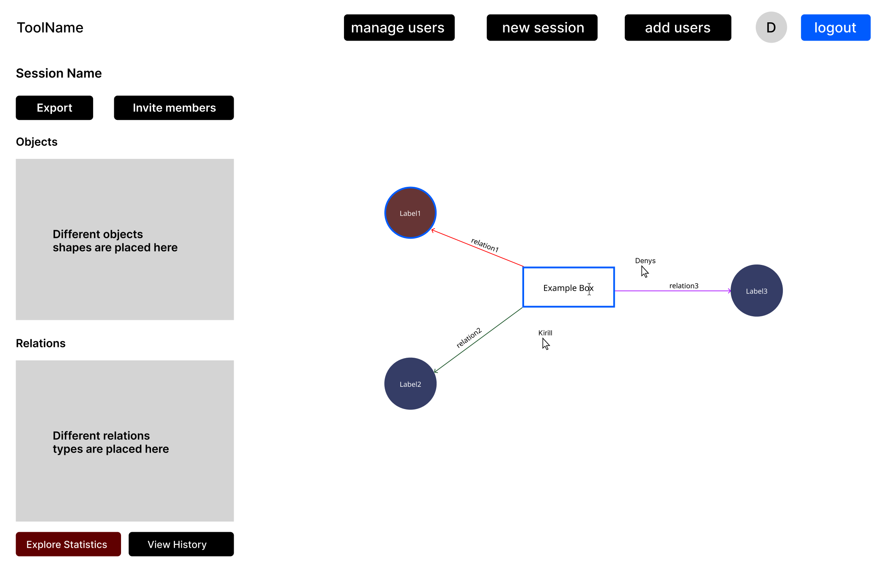

On the right-hand side, a collaboration space is provided. Users can create different diagrams and view changes in real
time. Objects can easily be deleted by clicking on it and press "delete" keyboard. If user wants to change a label,
he/she just presses a label and can immediately change it. When someone is making a change, their cursor, along with
their name, will be visible. If the users decide to change the object or label, they can simply select the object, and a
blue radius will appear.

#### Invite members and export

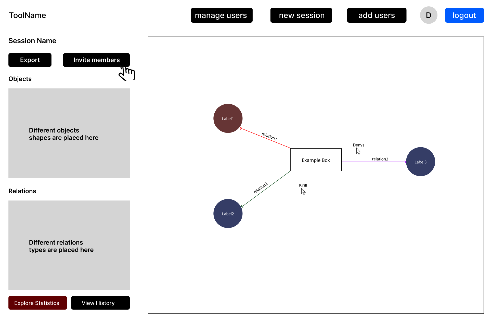

On the left-hand side, the "Export" button is used to export the created diagram as a Markdown file to Gitlub. The
project leader can invite new members to the project by clicking the "Invite Members" button.

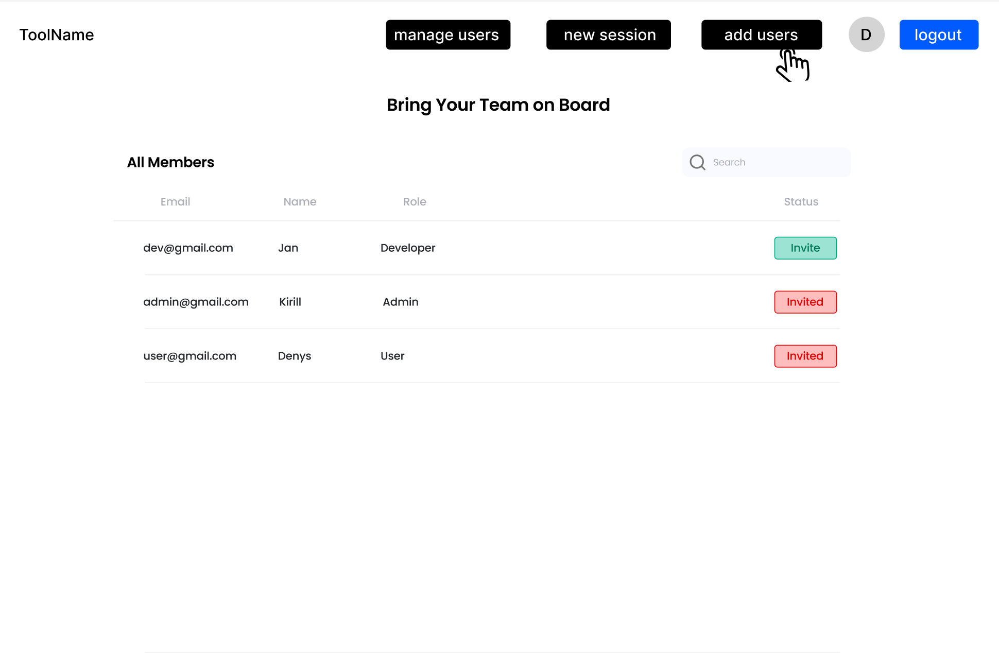

#### Create new users

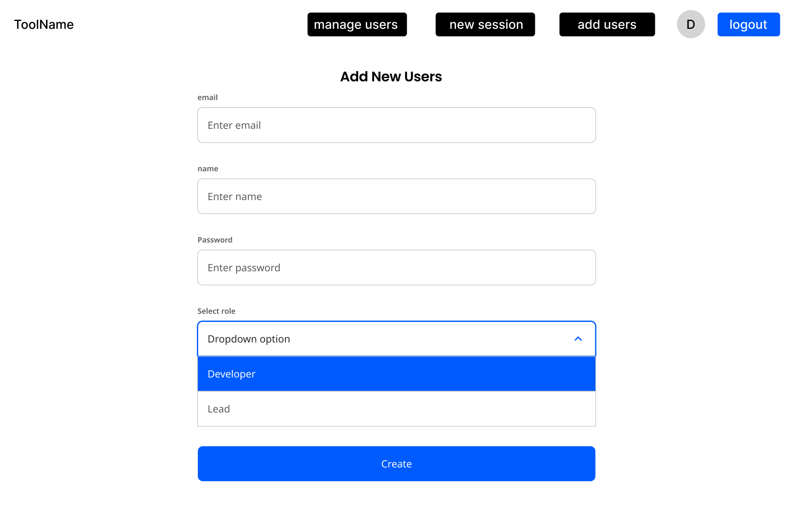

Administrator can create a new user by providing an email, name, password and role.

### 6. Statistics

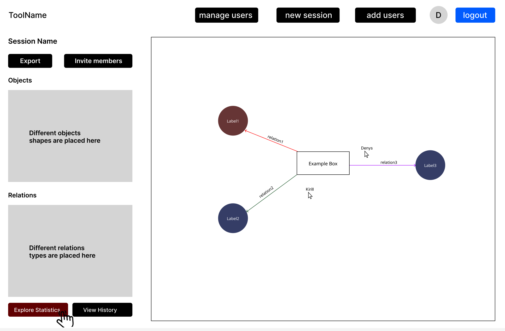
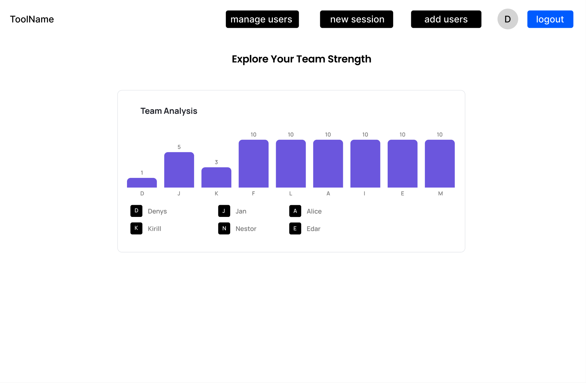

The "Explore Statistics" button displays the number of contributions made by project members. Users can see the names of
contributors along with the number of changes they have made, allowing for easy identification of the most active
participants in the project.

## Changelog

| By    | Changes                                               | Date       |
|-------|-------------------------------------------------------|------------|
| Jan   | Adding NF12 requirement                               | 19.01.2025 |
| Denys | Connecting wireframes together                        | 17.01.2025 |
| Jan   | Reworking Requirements and User Stories               | 17.01.2025 |
| Jan   | Introduction, Problem Analysis, Alternatives Research | 10.01.2025 |

[1]: https://www.drawio.com/blog/real-time-collaboration-diagrams

[2]: https://www.drawio.com/doc/faq/confluence-cloud-restore-version

[3]: https://www.drawio.com/blog/gitlab-wiki-integration

[4]: https://www.lucidchart.com/pages/examples/diagram-maker

[5]: https://miro.com/