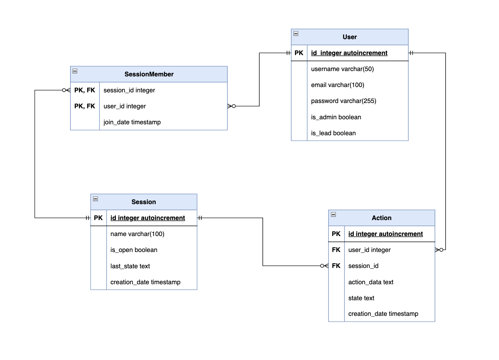

# Technical Design

# Introduction

# General overview and approach

# Design considerations

## Considerations for Visual Editor

The visual editor is the core feature of the application. Implementing rendering of nodes and edges from scratch would
take ages. Therefore, multiple libraries were considered:

- [svg.js](https://svgjs.dev/) - A very simple library just for the manipulation of **SVG**. It can be extended with
  plugins such as svg.draggable.js to support dragging elements or svg.panzoom.js to enable zooming in/out. Sadly, there
  is no mention of resizing/scaling.
- [fabricJS](https://fabricjs.com/) - A **canvas** editor outside the box. Supports (importing) images, text editing,
  and even exporting the editor state into JSON or SVG.
- [konvaJS](https://konvajs.org/) - Another **canvas** editor outside the box. Supports Svelte. The current editor state
  can be exported to JSON or a PNG image.
- [Svelte Flow](https://svelteflow.dev/) - A very recent library working with the **HTML DOM**. It provides a flowchart
  rendering outside the box with arrows (and labels) for connecting boxes, supports zooming in/out, and supports loading
  data from an object (e.g., JSON). The result can be exported to an image.

An honorable mention is [DgrmJS](https://github.com/AlexeyBoiko/DgrmJS), an open-source flowchart editor built purely in
JavaScript without external libraries. It has features such as real-time collaboration, undoing past actions, or zooming
in and out.

The team decided to choose [Svelte Flow](#svelte-flow) as it is feature-complete for our needs, and it can be very
easily extended or modified; it comes with an extensive documentation and examples.

## Considerations for Real-Time Update Technology

As the requested application requires real-time updates for session members, including session action updates,
live cursor tracking, and synchronized session state management, the team considered using WebSocket-based technology.
Detailed research was made to identify the most suitable technology for the application's needs,
ensuring compatibility with Svelte for the frontend and Node.js for the backend.

During this research, two options were evaluated: bare WebSockets and the Socket.IO library,
which is built on top of WebSockets.

### Research results

- Bare WebSockets are lightweight and efficient for real-time updates but lack features such as automatic reconnection,
  fallback mechanisms, and tools for shared state management. These limitations require additional development effort to
  handle connection drops and synchronize updates.

- Socket.IO built on top of WebSocket functionality, offering features like automatic reconnection, fallback mechanisms,
  event-driven communication, and tools such as rooms for session-specific updates and namespaces for better
  communication organization.

### Selected technology

The team decided to choose the Socket.IO library over bare WebSockets due to several key advantages.

Unlike raw WebSockets, Socket.IO provides built-in support for automatic reconnection,
eliminating the need to develop additional custom code for this functionality.

Additionally, Socket.IO offers fallback mechanisms for environments that do not support WebSockets,
a feature that bare WebSockets lack,
requiring developers to implement custom solutions to handle such scenarios.

Furthermore, Socket.IO includes built-in feature like rooms,
which allow efficient organization of communication channels,
enabling messages to be sent directly to specific groups
(e.g., members of a particular session) without iterating through all connections.
This feature is particularly valuable for this project as it requires targeted communication within sessions.

These capabilities significantly reduce development complexity,
ensure consistent connectivity, and streamline the implementation of synchronized updates.

# System Architecture

## Logical view (functional components)

## Hardware architecture (deploy)

## Software architecture (overview, libs, protocols, frameworks, components, api’s, etc)

### [Svelte Flow](https://svelteflow.dev/)

Svelte Flow is a library used for rendering nodes and edges and handling their input. It plays nicely with Svelte;
therefore, nodes (and even edges) can be easily extended with custom components. By default, it provides an editor with
zooming in and out, moving and connecting nodes, and deleting nodes, and edges. Adding nodes and modifying their content
must be implemented by the user.

### Database Engine

SQLite is used as the software library for database implementation in this project due to its lightweight and serverless
nature, which eliminates the need for complex setup or administration as required by systems like PostgreSQL. It is easy
to integrate and requires minimal configuration, making it an ideal choice for development environments. SQLite uses
file-based storage, where the entire database is contained within a single file, simplifying deployment and ensuring
portability across different environments. Furthermore, its suitability for local development eliminates the need for a
cloud database during the development phase, offering a cost-effective and efficient solution. Despite its simplicity,
SQLite ensures reliable and secure database transactions by being fully ACID-compliant(Atomicity, Consistency,
Isolation, Durability).

### Sequelize

Sequelize, an Object-Relational Mapping (ORM) library for Node.js, was used for database management. It allows
developers to define models representing database tables using JavaScript, manage relationships between them, and
perform CRUD (Create, Read, Update, Delete) operations in an intuitive and readable way, improving code maintainability.
Additionally, Sequelize supports multiple SQL dialects, such as SQLite, PostgresSQL, and MySQL. In this project, SQLite
was chosen, but Sequelize's flexibility ensures scalability if the database dialect needs to be changed in the future.
Its built-in features, such as migrations, validations, and associations, save development time and provide a
structured, consistent approach to database management.

### Socket.IO

Socket.IO is a library built on top of the WebSocket protocol,
designed for real-time, bidirectional communication between clients and servers.
It provides features such as automatic reconnection and fallback mechanisms for environments
where WebSocket connections are unavailable,
eliminating the need for custom code to handle such scenarios.
Additionally, it offers an event-driven communication model for streamlined interaction between the client and server.
Advanced tools, presented in a library, like rooms, allow grouping WebSocket connections,
enabling efficient messaging to specific groups without manually iterating through each connection.
Furthermore, multiplexing feature enables a single WebSocket connection to be divided into multiple logical channels,
called namespaces,
each acting as an independent communication channel
to better organize and manage the application's real-time update needs.

### Bcrypt

Bcrypt is a widely used library for securely hashing passwords. It provides a robust mechanism for storing sensitive
user credentials by encrypting passwords before they are saved to the database. This ensures that even if a database is
compromised, the actual passwords remain secure. Bcrypt also includes a method for comparing hashed passwords, which is
essential for user authentication systems. It helps mitigate the risk of password-based attacks like brute-force or
dictionary attacks.

### Cors

CORS (Cross-Origin Resource Sharing) is a middleware library used to enable secure communication between the frontend
and backend when they are hosted on different domains or ports. By default, browsers block web pages from making
requests to a different domain than the one the page was loaded from. CORS allows you to control which domains are
permitted to access resources on your server, thus enhancing security and enabling flexible application architectures.

### Dotenv

Dotenv simplifies the process of managing environment variables in Node.js applications. It loads environment-specific
variables from a `.env` file into the `process.env` object, ensuring that sensitive configuration data such as API keys,
database credentials, or secrets are kept outside the source code. This makes it easier to switch between different
environments (development, testing, production) without exposing sensitive data in the codebase.

### Express

Express is a minimal and flexible web framework for Node.js that simplifies building server-side applications. It
provides a robust set of features for handling HTTP requests, managing middleware, and routing. Express helps developers
quickly create APIs, handle user input, and manage sessions. Its lightweight nature makes it highly customizable, while
its extensive documentation and large community support make it a popular choice for building web applications.

### Express-async-errors

Express-async-errors is a small library that extends Express's error-handling capabilities. It allows you to write
asynchronous route handlers without having to manually catch and pass errors to the error-handling middleware. This
makes it easier to work with promises and async/await syntax, and ensures that uncaught errors are handled in a
consistent and graceful manner, improving the reliability of the application.

### Jsonwebtoken

Jsonwebtoken (JWT) is a library for securely transmitting information between parties as a JSON object. It is commonly
used for implementing token-based authentication in modern web applications. JWTs are typically issued after a user
successfully logs in and are used to authenticate requests. JWTs can contain claims (user data) and are signed using a
secret key to prevent tampering. This ensures that the user's identity can be verified without needing to store session
data on the server.

### Yup

Yup is a JavaScript schema validation library that allows developers to define the structure of data and validate it
against defined rules. It can be used to validate user input, form submissions, or API responses, ensuring that data
meets certain criteria before it is processed or stored. Yup supports complex validation scenarios, such as nested
objects, arrays, and custom validation rules. By using Yup, developers can catch errors early and ensure that the data
their application handles is consistent and correct.

### @biomejs/biome

Biome is a comprehensive code quality tool that integrates various features like linting, formatting, and static
analysis into a single package. It helps developers maintain a consistent code style, identify potential bugs or code
smells, and ensure best practices are followed. By using Biome, teams can automate code checks, reducing manual review
time and improving collaboration. It also supports TypeScript, JSX, and other modern syntax, making it a flexible choice
for JavaScript and TypeScript projects.

### Cross-env

Cross-env is a utility library that makes it easy to set environment variables in a consistent manner across different
operating systems (Linux, macOS, Windows). Environment variables are often used to configure settings for development,
testing, and production environments. Cross-env ensures that setting these variables works the same way, regardless of
the OS, avoiding issues with platform-specific syntax differences. It is commonly used in development scripts to set
environment-specific configurations.

### Supertest

Supertest is a testing library for making HTTP assertions in Node.js applications. It is designed to simplify the
process of writing integration tests for web applications and APIs. With Supertest, developers can easily make requests
to their APIs, check the status codes of responses, and validate response bodies. It integrates well with popular
testing frameworks like Mocha, Jest, or Vitest, making it easy to write and run tests for endpoints, ensuring that the
API behaves as expected under different conditions.

### Vitest

Vitest is a fast and modern testing framework for JavaScript, designed to provide a smooth testing experience for
Node.js and frontend applications. It supports features like snapshot testing, mocking, and code coverage out of the
box. Vitest is known for its speed, making it a great choice for projects that need quick feedback during development.
It is compatible with popular testing styles like Jest and Mocha and integrates well with other tools and libraries in
the testing ecosystem.

### Chart.js

Chart.js is a popular JavaScript library used to create interactive and visually appealing charts and graphs in web
applications. It provides an easy-to-use API for drawing various types of charts, including line, bar, radar, and pie
charts. With built-in animations and responsiveness, Chart.js is ideal for displaying data dynamically on the frontend.
It supports both static and real-time data updates, making it a versatile tool for creating data visualizations.

### Html-to-image

Html-to-image is a JavaScript library that allows you to convert HTML content into image files. It enables developers to
capture a portion of the webpage (or entire content) as an image, which can then be downloaded or shared. This is
particularly useful for generating reports, charts, or saving visual content directly from the browser. The library
supports various output formats like PNG and JPEG, and it can render HTML elements, including styles, images, and text,
into high-quality images.

## Information architecture (what data provided how, navigation)

## Security architecture

The developed system architecture is designed to ensure robust security for users,
protecting their data and preventing unauthorized access to restricted parts of the system.

The two key components of the security architecture are the **JSON Web Token (JWT)** and the **bcrypt library**.

**JSON Web Tokens (JWT)** are used to handle both authentication and authorization. JWT enables the secure transmission
of user data between the frontend and backend and implements role-based access control, ensuring that only users with
the appropriate permissions can access specific resources or perform certain actions.

**Backend:**

The backend uses **JWT** for authenticating and authorizing users across API routes and real-time WebSocket connections.
Upon login, the server generates a JWT containing user-specific data,
which is signed with a secure secret key and sent to the client.
This token,
included in the `Authorization` header for subsequent requests,
enables the backend to validate user identity and permissions.
Validation is performed using middlewares such as `verifyToken`,
`verifyIfAdmin`, and `verifyLeader`, which are applied to API routes.
These middlewares validate the JWT provided by the client
and restrict access to specific actions based on the user's role,
such as managing users or sessions.
Additionally, further validation is performed within controller functions to ensure data integrity—for example,
verifying if a user is part of a session
or if a session exists—returning appropriate error responses to prevent undesirable changes to the database.

**Bcrypt** is used to securely hash user passwords before storing them in the database. During login, bcrypt compares
the entered password with the stored hash, ensuring robust protection against brute-force attacks and safeguarding user
credentials.

The real-time communication functionality,
implemented using the **Socket.IO** library, also incorporates JWT for validation.
Custom middleware as `socketAuthMiddleware` validates JWTs sent from the frontend during the handshake process.
And further use it  
to ensure the user has the required permissions to perform specific actions within a session.
If a user attempts to perform unauthorized actions, appropriate error notifications are sent via the WebSocket,
ensuring real-time feedback and preventing unauthorized activities.

**Frontend:**

The frontend manages the JWT token using a `tokenStore`,
which stores the token in `localStorage` after login and clears it upon logout.
The `tokenStore` includes derived stores like `isAdminStore` and `isLeadStore`,
which are used to restrict access to UI elements and frontend pages based on user roles.
For example, UI components such as the "Manage Users" button (admin-only) and "Create Session"
button (leader-specific) are dynamically displayed by verifying the user role from the token.

Additionally,
access to restricted pages is controlled
to prevent unauthorized users or users without the necessary roles from accessing them directly via the browser.
These pages include role and authentication checks,
redirecting users to the login page if an unauthorized access attempt is detected.

API requests on the frontend are managed using utility functions get and request, which include the Authorization header
with the JWT (Bearer <token>) when sending requests. These functions ensure secure authentication and authorization for
all backend interactions.

## Performance

## GitLab

### Solutions for handling GitLab authorization:

#### [Personal Access Tokens](https://docs.gitlab.com/ee/user/profile/personal_access_tokens.html) / [Group Access Tokens](https://docs.gitlab.com/ee/user/group/settings/group_access_tokens.html) / [Project Access Tokens](https://docs.gitlab.com/ee/user/project/settings/project_access_tokens.html)

Pros:

- Easy set up

Cons:

- Tedious for the user (they would need to manually issue a new token in GitLab settings)

#### [OAuth 2.0](https://docs.gitlab.com/ee/api/oauth2.html)

Pros:

- Intuitive for the user ("Login with GitLab" →"Authorize" → done)

Cons:

- Hard to set up (need extra code for token management) ~ 3sp
- HTTPS is advised in production environment

### Token flow: possible implementation of remembering a token

#### No caching

Pros: Easy to implement.

Cons: User has to input the token on every export; possibly, they will also need to create an extra token.

#### Client-side caching (e.g. store it in localStorage)

Pros: Relatively easy to implement (1sp).

Cons: Does not persist after a re-login.

#### Server-side caching (e.g. database)

Pros: Convenient for the user (provide token once and use up to forever).

Cons:

- Hard to implement (require extra database fields and methods 3sp).
- Security concerns (data leak would expose access to user data on GitLab)

### Solutions for uploading data to GitLab

#### [GitLab API](https://docs.gitlab.com)

- [POST /projects/:id/repository/commits](https://docs.gitlab.com/ee/api/commits.html#create-a-commit-with-multiple-files-and-actions)
  can be used to create a commit and add any files to it.
- [PUT /projects/:id/repository/files/:file_path](https://docs.gitlab.com/ee/api/repository_files.html#update-existing-file-in-repository)
  can be used to update a single file in a repository. Unsure if it would fail if the file did not exist initially.
  Downside: Does not specify error messages.

Verdict: Even though Repository Files API technically covers all our needs, probably use Commits API because it is more
robust and allows more customization.

Possible Errors: TBD, but here are some hypotheses

- 401 — Forward to user, prompt to change access token / reauth
- 400 — Forward to user, check, possibly invalidate file path or repo

#### Git CLI

Another method would be to run git commands in a shell on a server, just like a person would. This could be viable if we
had to support arbitrary git repos, but since GitLab offers an API, it does not look feasible.

### Final solution

- Fully frontend-based
- Uses GitLab Access Tokens for authentication
- Uses localStorage for caching
- Uses GitLab Commits API for uploading

# System Design

## Database design

**Explanation of the database design:**

**Tables:**

**User Table:** It stores all information related to the users of the application.
It includes a unique,
auto-incremented `id` to identify each user, a `username` for display purposes,
and an `email` used for session invitations.
A hashed `password`  and 'email' is stored for login purposes.
Additionally, the table contains two boolean attributes, `is_admin`
and `is_lead`, which determines the user's role within the system.
If `is_admin` is set to true, the user is assigned the role of an Administrator.
If `is_lead` is set to true and `is_admin` is false, the user is assigned the role of a Team Lead.
If both `is_admin` and `is_lead` are set to false, the user is assigned the role of a Developer.

**Session table:** This table stores information about brainstorming sessions.
It includes a unique `id` field, which is an auto-incremented session ID used to identify each session.
The table also contains a `name` field
to provide a meaningful name for the session.
The `is_open` boolean field indicates the state of the session, such as "open" or "closed."
Additionally, it includes a `last_state` field to store the latest state of the session,
representing the current state of the session in a JSON/SVG format,
and a `creation_date` timestamp to record when the session was created.

**SessionMember table:** This table serves as a junction table between the `User` and `Session` tables,
representing the many-to-many relationship between users and sessions.
It includes two foreign keys: `session_id`,
which references the `id` field in the `Session` table to indicate the session a user is part of,
and `user_id`,
which references the `id` field in the `User` table to identify the specific user participating in the session.
The table does not have a separate primary key;
instead, the `session_id` and `user_id` foreign keys form the composite primary key.
Additionally, the table includes a `join_date` timestamp to record when the user joined the session.

**Action table:**
This table represents actions performed during brainstorming sessions and stores various types of actions,
such as adding, connecting elements, as well as redo and undo actions.
Each action has a unique, auto-incremented `id` field,
which serves as the action ID. The table includes a `user_id` foreign key
referencing the `id` field in the `User` table to identify the user who performed the action,
and a `session_id` foreign key
referencing the `id` field in the `Session` table to link the action to a specific session.
The `action_data` field stores information about the action, represented in JSON/SVG format.
Additionally, the table contains a `creation_date` timestamp to record when the action was performed.

**Relationships between tables:**

**User and Session relationship:**

The relationship between `User` and `Session` is many-to-many,
where a user can participate in multiple sessions, and each session can include multiple users.
This many-to-many relationship is implemented using the `SessionMember` table as a junction table.
The `SessionMember` table contains records representing the participation of specific users in specific sessions,
linking the `User` and `Session` tables.

**Action and Session relationship:**

The relationship between `Session` and `Action` is one-to-many,
where a session can have multiple actions performed during it,
but each action is associated with one specific session.

**Action and User relationship:**

The relationship between `User` and `Action` is one-to-many, with each user capable of performing multiple actions,
and each record in the `Action` table linked to a specific user who performed the action.

## User interface design

### Tailwind

In our project, we used Tailwind CSS, CSS framework, to streamline the styling process. Unlike traditional frameworks
such as Bootstrap, which come with pre-built components, Tailwind focuses on providing utility classes that allow to
take control over styling directly in your HTML.

This approach has several benefits:

- No Need for Class Naming: Tailwind eliminates the need to create custom class names and write separate CSS rules for
  each.
- Built-In Responsiveness: Tailwind provides an intuitive system for responsive design using prefixes.
- Productivity Boost: By using utility classes, we avoided jumping between HTML and CSS files, which significantly sped
  up the development process.

### Chart.js for statistics page

The statistics page of our application is designed to provide users with a clear, intuitive, and visually engaging way
to view and analyze data. Chart.js is a popular JavaScript library for creating responsive and interactive charts.
We have implemented the feature to keep track of the amount of contributions, together with a date.

#### Design Objectives

Data is present in a way that is easy to understand, even for non-technical users. It allows users to interact with the
charts to explore data in greater depth.

## Hardware design

## Software Design

## Security Design

# Changelog
